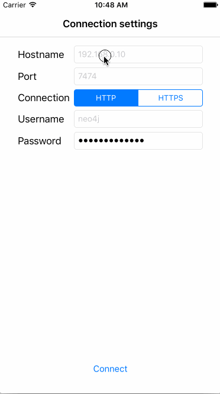

# theo-example
iOS example of how to use Theo, the Neo4j Swift framework for iOS, macOS and Linux

## Build & Run

If you haven't already, install [CocoaPods][https://cocoapods.org]:

```bash
$ gem install cocoapods
```

Then to set up the demo project and install its dependency Theo, run

```bash
$ pod install
```

Then open theo-example.xcworkspace and run it in your simulator

To run on device you need the necessary certificates

## Demo



In the first screen of our app, we set up the connection details. As you can see, there are a number of standard defaults, but you have probably another hostname and password. In the demo we access the local IP 10.200.1.125, use the default port 7474 for HTTP access and default username neo4j. We've modified the password, and thus we can connect.

How do we connect, you say? The REST API after all has no thought about a connection. Well, it really is just a test to see that the parameters are correct, so we grab the Neo4j instance's metadata:

```swift
theo = Client(baseURL: config.host, user: config.username, pass: config.password)
outputTextView?.text = "Connecting..."
theo?.metaDescription({ [weak self] (_, error) in
    DispatchQueue.main.async { [weak self] in
        if let error = error {
            self?.outputTextView?.text = "Error while connecting: \(error)"
        } else {
            self?.outputTextView?.text = "Connected"
            self?.enableButtons()
        }
    }
})
```

This and the following code is from [QueryViewController][https://github.com/niklassaers/theo-example/blob/master/theo-example/QueryViewController.swift].
What happens here is that we're creating a client based on the connection data provided, and ask it for metadata. Since we only reallly wanted to test the parameters, we ignore the returned data (the _ parameter in (_, error) ). Theo allows us to specify what DispatchQueue we want to have our results served on, but to be explicit we have not set this in the example and thus select the main dispatch queue when the answer returns. There we output any errors, and if there were none, we enable the four buttons we have set up with each their own query.

The first button we access is [Create a node][https://github.com/niklassaers/theo-example/blob/master/theo-example/QueryViewController.swift#L55]:

```swift
@IBAction func createNodeTapped(_ sender: UIButton) {
    let node = Node()
    let randomString: String = UUID().uuidString
    
    node.addLabel("TheoTest")
    node.setProp("propertyKey_1", propertyValue: "propertyValue_1" + randomString)
    node.setProp("propertyKey_2", propertyValue: "propertyValue_2" + randomString)
    
    theo?.createNode(node, completionBlock: { (node, error) in
        DispatchQueue.main.async { [weak self] in
            let text = self?.outputTextView?.text ?? ""
            if let error = error {
                self?.outputTextView?.text = "Error while creating node: \(error)\n\n\(text)"
            } else {
                let nodeId = node?.meta?.nodeID()
                self?.outputTextView?.text = "Created node with ID \(nodeId ?? "N/A")\n\n\(text)"
                if let nodeId = nodeId {
                    self?.lastNodeId = nodeId
                }
            }
        }
    })
}
```

Here we set up the node we want, and then ask theo to create it. Again, since we want to update the UI, we ask the main queue to handle our result, and display the created node's ID, as well as store the nodeId in an instance variable lastNodeId, that we'll use in our next example.

The second button we access is [Fetch created node][https://github.com/niklassaers/theo-example/blob/master/theo-example/QueryViewController.swift#L80] that will look up the last created node, the one we just stored the node ID of in the lastNodeId instance variable.

```swift
@IBAction func fetchNodeTapped(_ sender: UIButton) {
    let fetchingId = lastNodeId
    theo?.fetchNode(fetchingIdz, completionBlock: { (node, error) in
        DispatchQueue.main.async { [weak self] in
            let text = self?.outputTextView?.text ?? ""
            if let error = error {
                self?.outputTextView?.text = "Error while fetching node with ID '\(fetchingId)': \(error)\n\n\(text)"
            } else {
                self?.outputTextView?.text = "Fetched node with ID \(node?.meta?.nodeID() ?? "N/A") successfully\n\n\(text)"
            }
        }
    })

}
```
Because the instance variable can change while our query is running, we copy it to fetchingId. Then we query for that node, and assuming it is still there, we output that we successfully got it. If it has been deleted in the meanwhile, or the database has gone away, we display the error received.

In the demo video, we then skip forward to [Run transaction][https://github.com/niklassaers/theo-example/blob/master/theo-example/QueryViewController.swift#L113] where we run two cypher statements:
- ```CREATE (n:TheoTest { myProperty: 'A value' } )```
- ```CREATE (m:TheoTest { myProperty: 'Another value' } )```

```swift
@IBAction func runTransactionTapped(_ sender: UIButton) {
    let statement1 = [
        "statement" : "CREATE (n:TheoTest { myProperty: 'A value' } )" as AnyObject,
        "resultDataContents" : ["graph","row"] as AnyObject
    ]
    let statement2 = [
        "statement" : "CREATE (m:TheoTest { myProperty: 'Another value' } )" as AnyObject,
        "resultDataContents" : ["graph","row"] as AnyObject
    ]
    
    theo?.executeTransaction([statement1, statement2]) { (result, error) in
        DispatchQueue.main.async { [weak self] in
            let text = self?.outputTextView?.text ?? ""
            if let error = error {
                self?.outputTextView?.text = "Error while executing transaction: \(error)\n\n\(text)"
            } else {
                self?.outputTextView?.text = "Transaction completed successfully\n\n\(text)"
            }
        }
    }
    
}
```

As from the other examples, we then output whether the transaction was successful or not.

Finally, we [run a single cypher query][https://github.com/niklassaers/theo-example/blob/master/theo-example/QueryViewController.swift#L95], asking how many nodes there are labelled TheoTest:

```swift
@IBAction func runCypherTapped(_ sender: UIButton) {
    theo?.executeCypher("MATCH (n:TheoTest) RETURN count(n) AS num") { (result, error) in
        DispatchQueue.main.async { [weak self] in
            let text = self?.outputTextView?.text ?? ""
            if let error = error {
                self?.outputTextView?.text = "Error while executing cypher: \(error)\n\n\(text)"
            } else {
                var num = "N/A"
                if let data = result?.data,
                    let n = data.first?["num"] as? Int {
                    num = "\(n)"
                }
                self?.outputTextView?.text = "Asked via Cypher how many nodes there are with label TheoTest. Answer: \(num)\n\n\(text)"
            }
        }
    }
}
```

The result we get contains a data array that has one result for each element we asked for in the cypher query. Since we only asked for "count(n) AS num", we grab the first result with property "num" and display that in our output to the user.

Not demoed here are relationships, but you can manage them just as easily as nodes via fetchRelationshipsForNode(), createRelationship(), updateReleationship() and deleteRelationship() as well as through cypher.